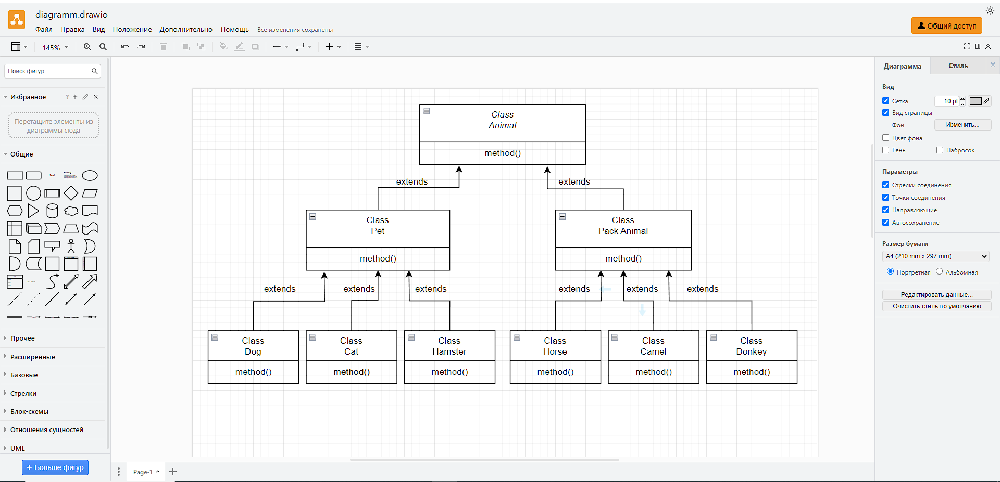

# Итоговая контрольная работа

### Информация о проекте
 Необходимо организовать систему учета для питомника в котором живут домашние и Pack animals. 

### Как сдавать проект 

Для сдачи проекта необходимо создать отдельный общедоступный репозиторий(Github, gitlub, или Bitbucket). Разработку вести в этом репозитории, использовать пул реквесты на изменения. Программа должна запускаться и работать, ошибок при выполнении программы быть не должно. Программа, может использоваться в различных системах, поэтому необходимо разработать класс в виде конструктора 

## Задание 

### Операционные системы и виртуализация (Linux)

1. Использование команды cat в Linux
   - Создать два текстовых файла: "Pets"(Домашние животные) и "Pack animals"(вьючные животные), используя команду `cat` в cтерминале Linux. В первом файле перечислить собак, кошек и хомяков. Во втором — лошадей, верблюдов и ослов.
   - Объединить содержимое этих двух файлов в один и просмотреть его содержимое.
   - Переименовать получившийся файл в "Human Friends"(.
Пример конечного вывода после команды “ls” :
Desktop Documents Downloads  HumanFriends.txt  Music  PackAnimals.txt  Pets.txt  Pictures  Videos

2. Работа с директориями в Linux
   - Создать новую директорию и переместить туда файл "Human Friends".
---
- cat > Pets.txt
- cat > PackAnimals.txt
- cat Pets.txt PackAnimals.txt > Animals.txt
- mv Animals HumanFriends.txt
- mkdir Farm
- mv HumanFriends.txt /home/sega/Farm
- cd Farm
- ls


---

3. Работа с MySQL в Linux. “Установить MySQL на вашу вычислительную машину ”
   - Подключить дополнительный репозиторий MySQL и установить один из пакетов из этого репозитория.

4. Управление deb-пакетами
   - Установить и затем удалить deb-пакет, используя команду `dpkg`.
---
- sudo wget https://dev.mysql.com/get/mysql-apt-config_0.8.23-1_all.deb
- sudo dpkg -i mysql-apt-config_0.8.23-1_all.deb
- sudo apt update
- sudo apt install mysql-server mysql-client
- sudo dpkg -r mysql-server mysql-client


5. История команд в терминале Ubuntu
   - Сохранить и выложить историю ваших терминальных команд в Ubuntu.
В формате: Файла с ФИО, датой сдачи, номером группы(или потока)

### Объектно-ориентированное программирование 

6. Диаграмма классов
   - Создать диаграмму классов с родительским классом "Животные", и двумя подклассами: "Pets" и "Pack animals".
В составы классов которых в случае Pets войдут классы: собаки, кошки, хомяки, а в класс Pack animals войдут: Лошади, верблюды и ослы).
Каждый тип животных будет характеризоваться (например, имена, даты рождения, выполняемые команды и т.д)
Диаграмму можно нарисовать в любом редакторе, такими как Lucidchart, Draw.io, Microsoft Visio и других.
---


---

7. Работа с MySQL (Задача выполняется в случае успешного выполнения задачи “Работа с MySQL в Linux. “Установить MySQL на вашу машину”

7.1. После создания диаграммы классов в 6 пункте, в 7 пункте база данных "Human Friends" должна быть структурирована в соответствии с этой диаграммой. Например, можно создать таблицы, которые будут соответствовать классам "Pets" и "Pack animals", и в этих таблицах будут поля, которые характеризуют каждый тип животных (например, имена, даты рождения, выполняемые команды и т.д.). 

7.2   - В ранее подключенном MySQL создать базу данных с названием "Human Friends".

```
CREATE DATABASE Human_friends;
```
---
- Создать таблицы, соответствующие иерархии из вашей диаграммы классов.
```
USE Human_friends;
CREATE TABLE animal_classes
(
	Id INT AUTO_INCREMENT PRIMARY KEY, 
	Class_name VARCHAR(20)
);

INSERT INTO animal_classes (Class_name)
VALUES ('вьючные'), ('домашние');  


CREATE TABLE pack_animals
(
	  Id INT AUTO_INCREMENT PRIMARY KEY,
    Genus_name VARCHAR (20),
    Class_id INT,
    FOREIGN KEY (Class_id) REFERENCES animal_classes (Id) ON DELETE CASCADE ON UPDATE CASCADE
);

INSERT INTO pack_animals (Genus_name, Class_id)
VALUES ('Лошади', 1),
('Ослы', 1),  
('Верблюды', 1); 
    
CREATE TABLE pets
(
	  Id INT AUTO_INCREMENT PRIMARY KEY,
    Genus_name VARCHAR (20),
    Class_id INT,
    FOREIGN KEY (Class_id) REFERENCES animal_classes (Id) ON DELETE CASCADE ON UPDATE CASCADE
);

INSERT INTO pets (Genus_name, Class_id)
VALUES ('Кошки', 2),
('Собаки', 2),  
('Хомяки', 2); 
```
---
- Заполнить таблицы данными о животных, их командах и датами рождения.
````
CREATE TABLE cats 
(       
    Id INT AUTO_INCREMENT PRIMARY KEY, 
    Name VARCHAR(20), 
    Birthday DATE,
    Commands VARCHAR(50),
    Genus_id int,
    Foreign KEY (Genus_id) REFERENCES pets (Id) ON DELETE CASCADE ON UPDATE CASCADE
);

INSERT INTO cats (Name, Birthday, Commands, Genus_id)
VALUES ('Пуся', '2021-06-09', 'кис-кис', 1),
('Муся', '2019-03-04', "вис-кас", 1),  
('Люся', '2022-05-01', "пшёл-вон", 1); 

CREATE TABLE dogs 
(       
    Id INT AUTO_INCREMENT PRIMARY KEY, 
    Name VARCHAR(20), 
    Birthday DATE,
    Commands VARCHAR(50),
    Genus_id int,
    Foreign KEY (Genus_id) REFERENCES pets (Id) ON DELETE CASCADE ON UPDATE CASCADE
);
INSERT INTO dogs (Name, Birthday, Commands, Genus_id)
VALUES ('Шарик', '2020-04-21', 'ко мне, лежать, лапу, голос', 2),
('Бобик', '2021-06-12', "сидеть, лежать, лапу", 2),  
('Децл', '2018-03-22', "сидеть, лежать, лапу, след, фас", 2), 
('Волк', '2021-01-30', "сидеть, лежать, фу, место", 2);

CREATE TABLE hamsters 
(       
    Id INT AUTO_INCREMENT PRIMARY KEY, 
    Name VARCHAR(20), 
    Birthday DATE,
    Commands VARCHAR(50),
    Genus_id int,
    Foreign KEY (Genus_id) REFERENCES pets (Id) ON DELETE CASCADE ON UPDATE CASCADE
);
INSERT INTO hamsters (Name, Birthday, Commands, Genus_id)
VALUES ('Миха', '2020-10-12', '', 3),
('Муха', '2021-03-12', "кусь", 3),  
('Ляля', '2022-07-11', "фас", 3), 
('По', '2022-05-10', NULL, 3);

CREATE TABLE horses 
(       
    Id INT AUTO_INCREMENT PRIMARY KEY, 
    Name VARCHAR(20), 
    Birthday DATE,
    Commands VARCHAR(50),
    Genus_id int,
    Foreign KEY (Genus_id) REFERENCES pack_animals (Id) ON DELETE CASCADE ON UPDATE CASCADE
);
INSERT INTO horses (Name, Birthday, Commands, Genus_id)
VALUES ('Гром', '2020-01-12', 'бегом, шагом', 1),
('Закат', '2017-03-12', "бегом, шагом, хоп", 1),  
('Байкал', '2016-07-12', "бегом, шагом, хоп, брр", 1), 
('Молния', '2020-11-10', "бегом, шагом, хоп", 1);

CREATE TABLE donkeys 
(       
    Id INT AUTO_INCREMENT PRIMARY KEY, 
    Name VARCHAR(20), 
    Birthday DATE,
    Commands VARCHAR(50),
    Genus_id int,
    Foreign KEY (Genus_id) REFERENCES pack_animals (Id) ON DELETE CASCADE ON UPDATE CASCADE
);
INSERT INTO donkeys (Name, Birthday, Commands, Genus_id)
VALUES ('Первый', '2019-04-10', NULL, 2),
('Второй', '2020-03-12', "", 2),  
('Третий', '2021-07-12', "", 2), 
('Четвертый', '2022-12-10', NULL, 2);

CREATE TABLE camels 
(       
    Id INT AUTO_INCREMENT PRIMARY KEY, 
    Name VARCHAR(20), 
    Birthday DATE,
    Commands VARCHAR(50),
    Genus_id int,
    Foreign KEY (Genus_id) REFERENCES pack_animals (Id) ON DELETE CASCADE ON UPDATE CASCADE
);
INSERT INTO camels (Name, Birthday, Commands, Genus_id)
VALUES ('Горбатый', '2022-04-10', 'вернись', 3),
('Самец', '2019-03-12', "остановись", 3),  
('Сифон', '2015-07-12', "повернись", 3), 
('Борода', '2022-12-10', "улыбнись", 3);
````
---
- Удалить записи о верблюдах и объединить таблицы лошадей и ослов.
```
SET SQL_SAFE_UPDATES = 0;
DELETE FROM camels;

SELECT Name, Birthday, Commands FROM horses
UNION SELECT  Name, Birthday, Commands FROM donkeys;
```
---
- Создать новую таблицу для животных в возрасте от 1 до 3 лет и вычислить их возраст с точностью до месяца.
```
CREATE TABLE animals AS 
SELECT *, 'Лошади' as genus FROM horses
UNION SELECT *, 'Ослы' AS genus FROM donkeys
UNION SELECT *, 'Собаки' AS genus FROM dogs
UNION SELECT *, 'Кошки' AS genus FROM cats
UNION SELECT *, 'Хомяки' AS genus FROM hamsters;

CREATE TABLE young_animals AS
SELECT Name, Birthday, Commands, genus, TIMESTAMPDIFF(MONTH, Birthday, CURDATE()) AS Age_in_month
FROM animals WHERE Birthday BETWEEN ADDDATE(curdate(), INTERVAL -3 YEAR) AND ADDDATE(CURDATE(), INTERVAL -1 YEAR);
 
SELECT * FROM young_animals;
```
---
- Объединить все созданные таблицы в одну, сохраняя информацию о принадлежности к исходным таблицам.
```
SELECT h.Name, h.Birthday, h.Commands, pa.Genus_name, yo.Age_in_month 
FROM horses h
LEFT JOIN young_animals yo ON yo.Name = h.Name
LEFT JOIN pack_animals pa ON pa.Id = h.Genus_id
UNION 
SELECT d.Name, d.Birthday, d.Commands, pa.Genus_name, yo.Age_in_month 
FROM donkeys d 
LEFT JOIN young_animals yo ON yo.Name = d.Name
LEFT JOIN pack_animals pa ON pa.Id = d.Genus_id
UNION
SELECT c.Name, c.Birthday, c.Commands, p.Genus_name, yo.Age_in_month 
FROM cats c
LEFT JOIN young_animals yo ON yo.Name = c.Name
LEFT JOIN pets p ON p.Id = c.Genus_id
UNION
SELECT d.Name, d.Birthday, d.Commands, p.Genus_name, yo.Age_in_month 
FROM dogs d
LEFT JOIN young_animals yo ON yo.Name = d.Name
LEFT JOIN pets p ON p.Id = d.Genus_id
UNION
SELECT hm.Name, hm.Birthday, hm.Commands, p.Genus_name, yo.Age_in_month 
FROM hamsters hm
LEFT JOIN young_animals yo ON yo.Name = hm.Name
LEFT JOIN pets p ON p.Id = hm.Genus_id;
```

---

8. ООП и Java
   - Создать иерархию классов в Java, который будет повторять диаграмму классов созданную в задаче 6(Диаграмма классов) .

9. Программа-реестр домашних животных
    - Написать программу на Java, которая будет имитировать реестр домашних животных. 
Должен быть реализован следующий функционал:
    
9.1. Добавление нового животного
        - Реализовать функциональность для добавления новых животных в реестр.       
 Животное должно определяться в правильный класс (например, "собака", "кошка", "хомяк" и т.д.)
         
9.2. Список команд животного
        - Вывести список команд, которые может выполнять добавленное животное (например, "сидеть", "лежать").
        
9.3. Обучение новым командам
        - Добавить возможность обучать животных новым командам.
9.4 Вывести список животных по дате рождения

9.5. Навигация по меню
        - Реализовать консольный пользовательский интерфейс с меню для навигации между вышеуказанными функциями.
        
10. Счетчик животных
Создать механизм, который позволяет вывести на экран общее количество созданных животных любого типа (Как домашних, так и вьючных), то есть при создании каждого нового животного счетчик увеличивается на “1”. 
  


